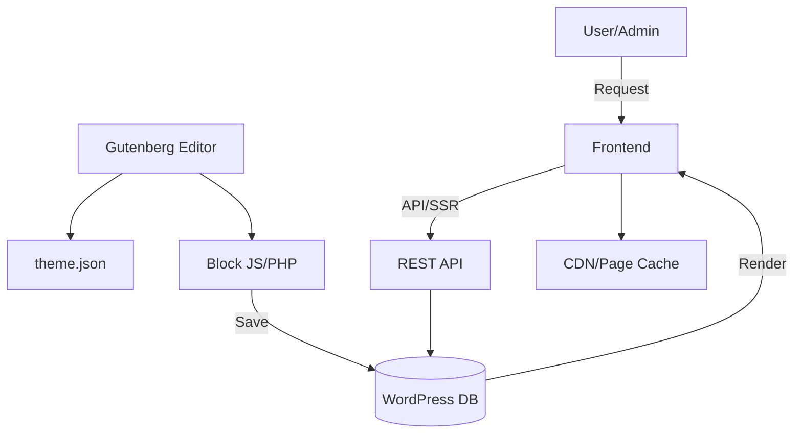

_Note: This file follows LightSpeedWP governance, frontmatter, naming, and versioning conventions as described in [docs/VERSIONING.md](VERSIONING.md) and [.github/FRONTMATTER-SCHEMA.md](../.github/FRONTMATTER-SCHEMA.md)._

<!-- markdownlint-disable MD007 MD031 MD032 MD022 MD003 MD012 MD009 MD047 MD049 -->

# LightSpeed Architecture
<!-- markdownlint-enable MD007 MD047 -->

This document outlines the project architecture, major components, data flows, and the automation/agent ecosystem for the LightSpeed stack. It is focused on modern WordPress, block themes, plugins, and a governance-driven, automation-first workflow.

---

## Components

- **Theme JSON:** Centralized configuration for styles, settings, and custom properties. Serves as the “single source of truth” for color, typography, spacing, and global settings affecting both editor and frontend.
- **Block Patterns & Templates:** Reusable layout definitions, registered via PHP or `block.json`. Patterns enable rapid assembly of complex pages with consistent design and structure.
- **Plugin Modules:** Extensible functionality and integration points. Typical uses include custom post types (CPTs), REST endpoints, user roles, admin UI panels, and automation hooks.
- **Custom Blocks:** Editor components (React/JS + PHP) for custom content and UI. Registered in `block.json` and exposed via JavaScript and server-side PHP render callbacks.
- **API Integrations:** REST, GraphQL, and 3rd-party APIs for data, search, analytics, e-commerce, external content, or headless frontends.
- **Automation/Agents:** GitHub Actions workflows, custom agents, and scripts for testing, linting, documentation, release automation, labeling, project meta sync, and compliance. See [docs/WORKFLOWS.md](WORKFLOWS.md).

---

## Data Architecture

### 1. WordPress Core Data Model

- **Posts & Custom Post Types (CPTs):**
  - Built-in post types (`post`, `page`) and project-specific CPTs (e.g., `case_study`, `product`, `testimonial`), registered with custom capabilities, permalinks, and REST visibility.
  - Template parts and block templates for CPT layouts.

- **Taxonomies:**
  - Built-in (`category`, `post_tag`) and custom taxonomies (e.g., `industry`, `topic`), for classification, filtering, and navigation.

- **Meta & Options:**
  - Post meta for block-level data, custom fields, and settings (`register_meta`, `get_post_meta`).
  - Site options (`get_option`, `update_option`) for global/site-level settings, always registered with proper sanitization and REST support.

- **Users & Roles:**
  - Standard and custom roles (administrator, editor, author, “Content Reviewer”, etc.) with granular capabilities.

### 2. Block & Pattern Data

- **Theme JSON:**  
  - Stores global styles (colors, typography), settings (spacing, layout), and design tokens.
  - Enables consistency between editor and frontend; supports block-level style overrides.

- **Block Patterns:**
  - Defined as PHP arrays, YAML, or Markdown, and registered in `patterns/`.
  - Used for page sections, CTAs, hero blocks, testimonial grids, etc.

- **Block Attributes:**  
  - Types, defaults, allowed values, serialization for each block property. Validated and sanitized in JS and PHP.
  - Enables dynamic content (e.g., query blocks, dynamic images).

- **Block Metadata:**
  - `block.json` includes name, category, icon, attributes, style variations, and support config.
  - Use `providesContext` and `usesContext` for context-aware blocks.

### 3. Content & Media Flow

- **Media Library:**  
  - Media files stored in the WP uploads directory, referenced via attachment IDs/URLs.
  - Block attributes and custom fields link media to blocks/CPTs. Media metadata (alt text, captions, sizes) for accessibility/responsive images.

- **Relationships:**  
  - Post relationships (ACF, post_parent, post__in, or custom tables) for relating entries (e.g., case studies to products).

- **Internationalization:**  
  - Use WPML, Polylang, or custom tables for multi-language support.
  - All user-facing text, block content, and metadata must be translatable (`__()`, `esc_html__()`).
  - Store translations for block data/meta where applicable.

### 4. Data Storage & Querying

- **Database Tables:**
  - WordPress core tables for posts, meta, terms, options.
  - Custom tables for high-volume, performance-critical, or complex relational data, with schema, indexing, and migrations.

- **REST API:**
  - Built-in and custom REST endpoints for headless, SPA, or mobile clients.
  - Secured with permission callbacks, nonces, and capability checks.

- **GraphQL (optional):**
  - WPGraphQL for decoupled/headless frontends, enabling flexible, performant queries; restrict schema for security/performance.

- **Caching:**
  - Object caching (Redis/Memcached), page caching/CDN.
  - Invalidate cache on content changes or deploys.

- **Search & Indexing:**
  - Core WP search, ElasticPress, or Algolia for advanced search.
  - Index custom fields, block content, and taxonomies as needed.

### 5. Security & Compliance

- **Sanitization/Escaping:**
  - Sanitize all input (`sanitize_text_field`, etc.); escape all output (`esc_html`, `esc_attr`, `wp_kses_post`).

- **User Permissions/Access Control:**
  - `current_user_can()` for write/modify endpoints; per-field/resource permissions for sensitive data.

- **GDPR/Data Privacy:**
  - Store and honor user consent, anonymize/pseudonymize data as required; maintain clear data flow documentation and audit trails.

- **Audit & Monitoring:**
  - Log critical actions, failed logins, permission escalations. Use monitoring agents/plugins (e.g., Activity Log, WP Security Audit Log).

### 6. Data Flow Example

---

## Automation & Workflow Integration

- **Automation and agents are integral to the project’s operational architecture.**
- GitHub Actions workflows and custom agents enforce:
  - CI/CD, testing, and linting
  - Labeling, project board synchronization, and metadata governance
  - Release management and changelog enforcement
  - Automated PR review, merge readiness, and status enforcement
- These systems orchestrate and validate the flow of code, issues, PRs, releases, and documentation, and interact with your data model (e.g., updating metadata, syncing labels, injecting changelog entries).
- All workflows are governed and documented in [docs/WORKFLOWS.md](WORKFLOWS.md) and are as fundamental to the project’s architecture as the codebase itself.

---

## Best Practices & Considerations

- **Keep data normalized:** Avoid redundant storage of the same value in multiple places.
- **Document custom tables:** Use schema diagrams and README notes.
- **Automate migrations:** Use WP-CLI, custom scripts, or plugin frameworks.
- **Leverage standards:** Prefer core WP APIs for data access/manipulation; only use custom solutions where justified.
- **Secure endpoints:** Assume all external input is untrusted.
- **Test for performance:** Benchmark queries and endpoints regularly.

---

## Security & Performance

- Always escape/sanitize data at input and output.
- Use object/page caching and optimize DB queries.
- Minimize data exposure via REST/GraphQL.
- Monitor for security breaches and data anomalies.

---

## Comparison to Industry

- Follows modern WP "headless" and block-based best practices.
- Modular plugin/theme structure for scalability and maintainability.
- Aligns with JAMstack and API-first approaches for external integrations.
- Designed to support multi-channel publishing, rapid prototyping, and automation.

---

_This architecture section should be updated as the project adds new data models, automation, agents, services, or integration patterns._